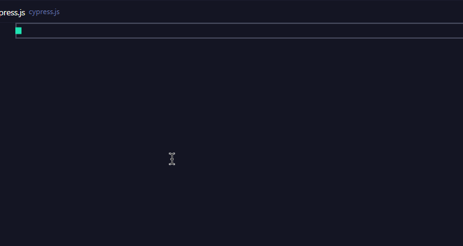
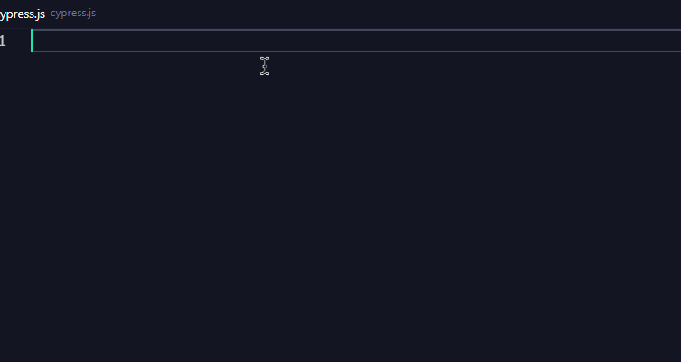
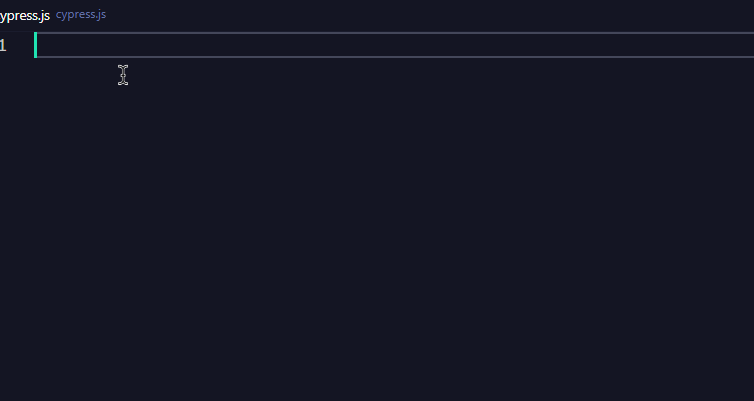

# VS Code Cypress Snippets

**_The goal is to integrate Cypress Faker and Testing as well, providing Cypress with a complete e2e test environment._**

If you like it, please leave your Rating & Review and share it with your friends.

## Installation

In order to install an extension, you need to open the Extensions Palette (`Ctrl + Shift + X` or `Cmd ⌘ + Shift + X`). There you have either the option to show the already installed snippets or install new ones.

## Supported Languages (file extensions)

- JavaScript (.js .jsx)
- TypeScript (.ts .tsx)

## Snippets

### Cypress Snippets

| Snippets | Descript                                                                |
| -------- | ----------------------------------------------------------------------- |
| `cpr`    | `A base test service set`                                               |
| `cdr`    | `Test Suite Template`                                                   |
| `ctx`    | `Test context block`                                                    |
| `chk`    | `Life cycle hooks`                                                      |
| `cvt`    | `Expects the page to show the content with 200 status code.`            |
| `cit`    | `Test case`                                                             |
| `cvi`    | `Control the size and orientation of the screen for your application.`  |
| `cia`    | `Implicit assertion`                                                    |
| `cdi`    | `Display assertion`                                                     |
| `cyy`    | `Get a property's value or function on the previously yielded subject.` |
| `cipt`   | `Provides input box related event instructions`                         |
| `cma`    | ` Mouse-related evetns`                                                 |
| `cki`    | `Cookies-related evetns`                                                |
| `cks`    | `Storage-related evetns`                                                |
| `creq`   | `Make a HTTP request`                                                   |
| `cior`   | `Interception of requests`                                              |
| `cqd`    | `Queries the DOM`                                                       |

## Usage

**_Demonstrate some of the commands, and then explain the convenience it provides for you._**

### 1. Implicit assertion

This directive provides a common syntax fragment for implicitly declaring the assertions 'should' and' and'

### 2. Queries the DOM

This instruction provides snippets of common element query operations

### 3. Interception of requests

This directive provides a snippet of code that intercepts an HTTP request

**[⬆ Back to top](#Installation)**

## Change Log

See the [CHANGELOG](./CHANGELOG.md) for details about the changes in each version.

## License

[MIT](./LICENSE)
